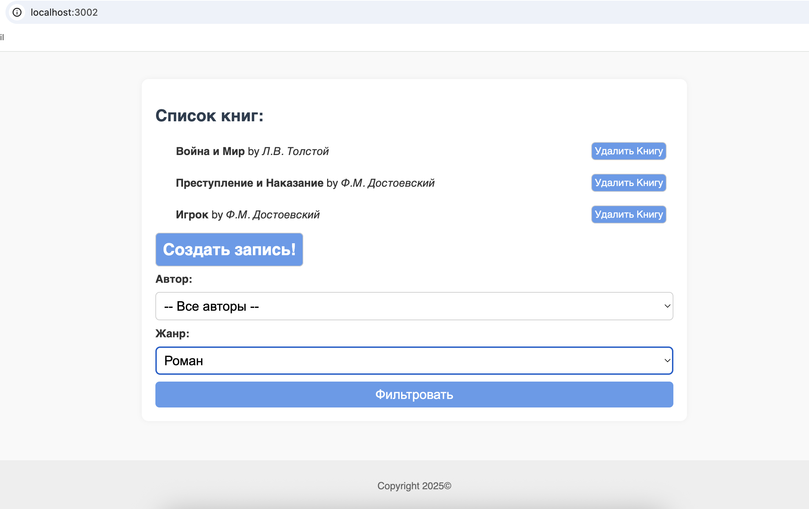
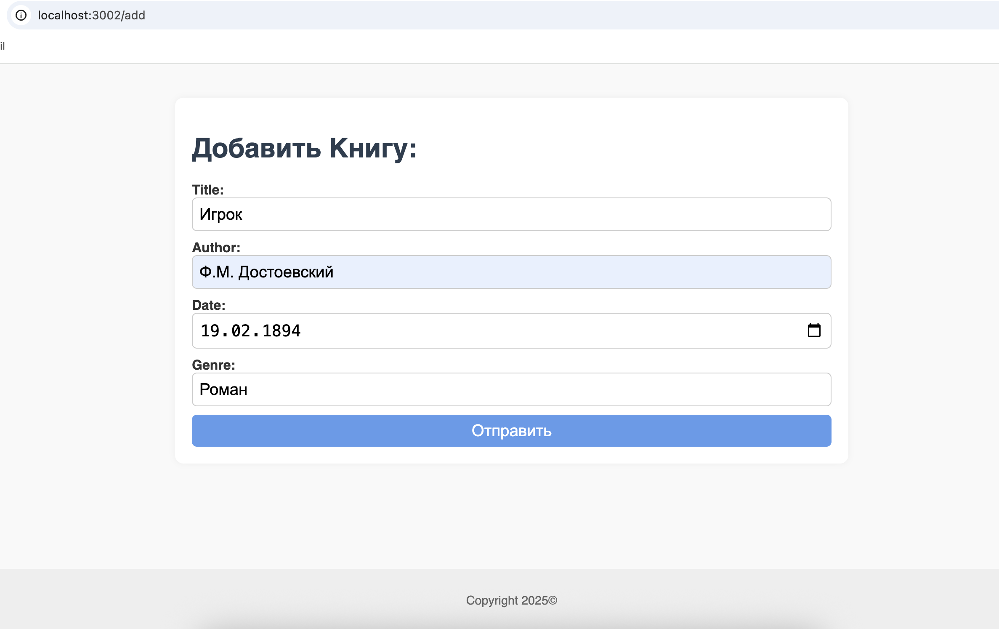

# 📚 Book-Journal — простая библиотека книг на PHP

Проект реализует базовое CRUD-приложение для управления книгами. Он написан на чистом PHP с использованием принципов ООП
и паттерна MVC.

---

## 🚀 Функциональность

- Добавление книг с полями: название, автор, жанр, дата
- Фильтрация списка книг по автору и жанру
- Удаление книг
- Простой роутинг без фреймворков
- Обработка 404-страницы
- Валидация пользовательского ввода
- Чистая верстка с базовыми стилями (пастельные тона)

---

## 🧱 Технологии

- PHP 8+
- ООП (наследование, инкапсуляция, трейты)
- PDO для работы с MySQL
- HTML/CSS (без фреймворков)
- Чистая структура MVC
- Composer (автозагрузка)

---

## 🗂 Структура проекта

public/ - точка входа, стили, index.php
src/
Controllers/ - контроллеры
Models/ - модели книги и библиотеки
Views/ - шаблоны страниц
Core/ - роутер, БД, логгер
config/ - подключение к БД

---

## ⚙️ Как запустить проект

1. Клонируйте репозиторий:
   ```bash
   git clone https://github.com/Onotolius/oop-books.git
   cd oop-books


2. Установите composer: composer install
3. Настройте подключение к базе данных в src/config/db-connection.php
4. Запустите встроенный PHP-сервер: php -S localhost:8000 -t public
5. В бразуере пройдите по: http://localhost:8000

## 🖼 Скриншоты

### 📚 Главная страница



### ➕ Добавление книги


